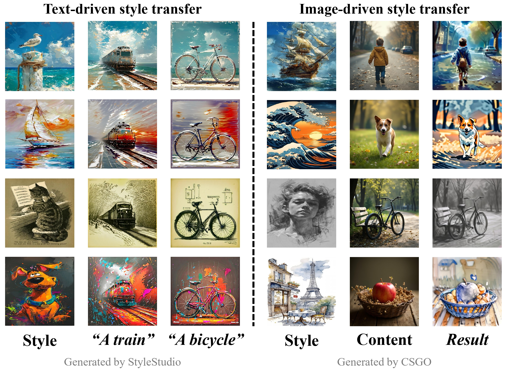

<!-- 

<h2> Awesome Style Transfer with Diffusion Models </h2> 

 -->
# 🥳Awesome Style Transfer with Diffusion Models  

# 🤗 Introduction
- This repository contains a curated list of **Style Transfer with Diffusion Models**. The resources are organized into two main categories: Image Synthesis and Video Synthesis. 
In the context of Image Style Transfer, the techniques can be categorized into two primary types: text-driven style transfer and image-driven style transfer.

  

- We welcome any contributions and suggestions to our repository or the addition of your own work. Feel free to make a pull request or leave your comments!!

# 📋 Contents
- [🤗 Introduction](#-introduction)
- [📋 Contents](#-contents)
- [💘 Tips](#-tips)
- [📍 Image Synthesis](#-image-synthesis)
  - [Text-Driven Style Transfer](#text-driven-style-transfer)
    - [Image-Encoder Based](#image-encoder-based)
    - [Textual-Inversion Based](#textual-inversion-based)
    - [Swap Features In Attention Layer](#swap-features-in-attention-layer)
    - [Fine-tune Methods](#fine-tune-methods)
    - [Training-free Methods](#training-free-methods)
  - [Image-Driven Style Transfer](#image-driven-style-transfer)
    - [Text-Guided Style Transfer](#text-guided-style-transfer)
    - [None Diffusion Models](#none-diffusion-models)
- [📍 Video Synthesis](#-video-synthesis)
  - [Text-to-Video Generation](#text-to-video-generation)
  - [Video-to-Video Translation](#video-to-video-translation)
- [📍 3D Generation](#-3d-generation)
- [📍 Related Research and Surveys](#-related-research-and-surveys)

# 💘 Tips
- **✅ Paper searching via catatogue**: directly clicking the content of the catatogue to select the area of your research and browse related papers.
- **✅ Paper searching via author name**: Free feel to search papers of a specific author via `ctrl/cmd + F` and then type the author name. The dropdown list of authors will automatically expand when searching.

# 📍 Image Synthesis
## Text-Driven Style Transfer
### Image-Encoder Based

+ **IP-Adapter: Text Compatible Image Prompt Adapter for Text-to-Image Diffusion Models** (13 Aug 2023) 

Hu Ye, Jun Zhang et al.
Hu Ye, Jun Zhang, Sibo Liu, Xiao Han, Wei Yang

+ **StyleAdapter: A Unified Stylized Image Generation Model** (4 Sep 2023) 

Zhouxia Wang, Xintao Wang et al.
Zhouxia Wang, Xintao Wang, Liangbin Xie, Zhongang Qi, Ying Shan, Wenping Wang, Ping Luo

+ **ArtAdapter: Text-to-Image Style Transfer using Multi-Level Style Encoder and Explicit Adaptation** (4 Dec 2023) 

[CVPR 2024] Dar-Yen Chen, Hamish Tennent et al.
Dar-Yen Chen, Hamish Tennent, Ching-Wen Hsu

+ **InstantStyle: Free Lunch towards Style-Preserving in Text-to-Image Generation** (3 Apr 2024) 

Haofan Wang, Matteo Spinelli et al.
Haofan Wang, Matteo Spinelli, Qixun Wang, Xu Bai, Zekui Qin, Anthony Chen

+ **DEADiff: An Efficient Stylization Diffusion Model with Disentangled Representations** (11 Mar 2024) 

[CVPR 2024] Tianhao Qi, Shancheng Fang et al.
Tianhao Qi, Shancheng Fang, Yanze Wu, Hongtao Xie, Jiawei Liu, Lang Chen, Qian He, Yongdong Zhang

+ **StyleMaster: Towards Flexible Stylized Image Generation with Diffusion Models** (24 May 2024) 

Chengming Xu, Kai Hu et al.
Chengming Xu, Kai Hu, Donghao Luo, Jiangning Zhang, Wei Li, Yanhao Ge, Chengjie Wang

+ **StyleShot: A Snapshot on Any Style** (1 Jul 2024) 

Junyao Gao, Yanchen Liu et al.
Junyao Gao, Yanchen Liu, Yanan Sun, Yinhao Tang, Yanhong Zeng, Kai Chen, Cairong Zhao

+ **CSGO: Content-Style Composition in Text-to-Image Generation** (29 Aug 2024) 

Peng Xing, Haofan Wang et al.
Peng Xing, Haofan Wang, Yanpeng Sun, Qixun Wang, Xu Bai, Hao Ai, Renyuan Huang, Zechao Li

+ **StyleTokenizer: Defining Image Style by a Single Instance for Controlling Diffusion Models** (4 Sep 2024) 

[ECCV 2024] Wen Li, Muyuan Fang et al.
Wen Li, Muyuan Fang, Cheng Zou, Biao Gong, Ruobing Zheng, Meng Wang, Jingdong Chen, Ming Yang

 

+ **StyleStudio: Text-Driven Style Transfer with Selective Control of Style Elements** (11 Dec 2024) 

[CVPR 2025] Mingkun Lei, Xue Song et al.
Mingkun Lei, Xue Song, Beier Zhu, Hao Wang, Chi Zhang

 

+ **EasyRef: Omni-Generalized Group Image Reference for Diffusion Models via Multimodal LLM** (12 Dec 2024) 

 Zhuofan Zong, Dongzhi Jiang et al.
Zhuofan Zong, Dongzhi Jiang, Bingqi Ma, Guanglu Song, Hao Shao, Dazhong Shen, Yu Liu, Hongsheng Li

+ **ArtCrafter: Text-Image Aligning Style Transfer via Embedding Reframing** (3 Jan 2025) 

 Nisha Huang, Kaer Huang et al.
Nisha Huang, Kaer Huang, Yifan Pu, Jiangshan Wang, Jie Guo, Yiqiang Yan, Xiu Li

+ **Less is More: Masking Elements in Image Condition Features Avoids Content Leakages in Style Transfer Diffusion Models** (11 Feb 2025) 

[ICLR 2025] Lin Zhu, Xinbing Wang et al.
Lin Zhu, Xinbing Wang, Chenghu Zhou, Qinying Gu, Nanyang Ye

### Textual-Inversion Based

+ **An Image is Worth One Word: Personalizing Text-to-Image Generation using Textual Inversion** (2 Aug 2022) 

[ICLR 2023] Rinon Gal, Yuval Alaluf et al.
Rinon Gal, Yuval Alaluf, Yuval Atzmon, Or Patashnik, Amit H. Bermano, Gal Chechik, Daniel Cohen-Or

+ **Inversion-Based Style Transfer with Diffusion Models** (23 Nov 2022) 

[CVPR 2023] Yuxin Zhang, Nisha Huang et al.
Yuxin Zhang, Nisha Huang, Fan Tang, Haibin Huang, Chongyang Ma, Weiming Dong, Changsheng Xu

+ **An Image is Worth Multiple Words: Multi-attribute Inversion for Constrained Text-to-Image Synthesis** (20 Nov 2023) 

Aishwarya Agarwal et al.
Aishwarya Agarwal, Srikrishna Karanam, Tripti Shukla, Balaji Vasan Srinivasan

### Swap Features In Attention Layer

+ **Cross-Image Attention for Zero-Shot Appearance Transfer** (6 Nov 2023) 

[SIGGRAPH 2024] Yuval Alaluf, Daniel Garibi et al.
Yuval Alaluf, Daniel Garibi, Or Patashnik, Hadar Averbuch-Elor, Daniel Cohen-Or

+ **Style Aligned Image Generation via Shared Attention** (4 Dec 2023) 

[CVPR 2024] Amir Hertz, Andrey Voynov et al.
Amir Hertz, Andrey Voynov, Shlomi Fruchter, Daniel Cohen-Or

+ **Visual Style Prompting with Swapping Self-Attention** (20 Feb 2024) 

Jaeseok Jeong, Junho Kim et al.
Jaeseok Jeong, Junho Kim, Yunjey Choi, Gayoung Lee, Youngjung Uh

+ **StyleGuide: Crafting visual style prompting with negative visual query guidance**  

+ **Training-free Color-Style Disentanglement for Constrained Text-to-Image Synthesis** 

Yujia Gu, Haofeng Li et al.
Yujia Gu, Haofeng Li, Xinyu Fang, Zihan Peng, Yinan Peng
 

### Fine-tune Methods & LoRA-Based Methods

+ **Diffusion in Style** 

[ICCV 2023] Martin Nicolas Everaert, Marco Bocchio et al.
Martin Nicolas Everaert, Marco Bocchio, Sami Arpa, Sabine Süsstrunk, Radhakrishna Achanta

+ **StyleDrop: Text-to-Image Generation in Any Style** (1 Jun 2023) 

[NeurIPS 2023] Kihyuk Sohn, Nataniel Ruiz et al.
Kihyuk Sohn, Nataniel Ruiz, Kimin Lee, Daniel Castro Chin, Irina Blok, Huiwen Chang, Jarred Barber, Lu Jiang, Glenn Entis, Yuanzhen Li, Yuan Hao, Irfan Essa, Michael Rubinstein, Dilip Krishnan

+ **DreamStyler: Paint by Style Inversion with Text-to-Image Diffusion Models** (13 Sep 2023) 

[AAAI 2024] Namhyuk Ahn, Junsoo Lee et al.
Namhyuk Ahn, Junsoo Lee, Chunggi Lee, Kunhee Kim, Daesik Kim, Seung-Hun Nam, Kibeom Hong

+ **ControlStyle: Text-Driven Stylized Image Generation Using Diffusion Priors** (9 Nov 2023) 

[MM 2023] Jingwen Chen, Yingwei Pan et al.
Jingwen Chen, Yingwei Pan, Ting Yao, Tao Mei

+ **ZipLoRA: Any Subject in Any Style by Effectively Merging LoRAs** (22 Nov 2023) 

Viraj Shah, Nataniel Ruiz et al.
Viraj Shah, Nataniel Ruiz, Forrester Cole, Erika Lu, Svetlana Lazebnik, Yuanzhen Li, Varun Jampani

+ **Implicit Style-Content Separation using B-LoRA** (21 Mar 2024) 

[ECCV 2024] Yarden Frenkel, Yael Vinker et al.
Yarden Frenkel, Yael Vinker, Ariel Shamir, Daniel Cohen-Or

+ **Frequency-Controlled Diffusion Model for Versatile Text-Guided Image-to-Image Translation** (3 Jul 2024) 

[AAAI 2024] Xiang Gao, Zhengbo Xu et al.
Xiang Gao, Zhengbo Xu, Junhan Zhao, Jiaying Liu

+ **UnZipLoRA: Separating Content and Style from a Single Image** (5 Dec 2024) 

Chang Liu, Viraj Shah et al.
Chang Liu, Viraj Shah, Aiyu Cui, Svetlana Lazebnik

+ **K-LoRA: Unlocking Training-Free Fusion of Any Subject and Style LoRAs** (25 Feb 2025) 

Ziheng Ouyang et al.
Ziheng Ouyang, Zhen Li, Qibin Hou

+ **ConsisLoRA: Enhancing Content and Style Consistency for LoRA-based Style Transfer** (13 Mar 2025) 

Bolin Chen et al.
Bolin Chen, Baoquan Zhao, Haoran Xie, Yi Cai, Qing Li, Xudong Mao

### Training-free Methods
+ **FreeDoM: Training-Free Energy-Guided Conditional Diffusion Model** (17 Mar 2023) 

[ICCV 2023] Jiwen Yu, Yinhuai Wang et al.
Jiwen Yu, Yinhuai Wang, Chen Zhao, Bernard Ghanem, Jian Zhang

+ **VectorPainter: Advanced Stylized Vector Graphics Synthesis Using Stroke-Style Priors** (5 May 2024) 

[ICME 2025] Juncheng Hu et al.
Juncheng Hu, Ximing Xing, Jing Zhang, Qian Yu

+ **Training Free Stylized Abstraction** (28 May 2025) 

Aimon Rahman et al.
Aimon Rahman, Kartik Narayan, Vishal M. Patel

#### Test-time optimization
+ **RB-Modulation: Training-Free Personalization of Diffusion Models using Stochastic Optimal Control** (ICLR 2025) 

Litu Rout, Yujia Chen et al.
Litu Rout, Yujia Chen, Nataniel Ruiz, Abhishek Kumar, Constantine Caramanis, Sanjay Shakkottai, Wen-Sheng Chu

+ **Attention Distillation: A Unified Approach to Visual Characteristics Transfer** (CVPR 2025) 

Yang Zhou et al.
Yang Zhou, Xu Gao, Zichong Chen, Hui Huang

## Image-Driven Style Transfer

+ **General Image-to-Image Translation with One-Shot Image Guidance** (20 Jul 2023) 

Bin Cheng, Zuhao Liu et al.
Bin Cheng, Zuhao Liu, Yunbo Peng, Yue Lin

 

+ **Null-text Guidance in Diffusion Models is Secretly a Cartoon-style Creator** (11 May 2023) 

[MM 2023] Bin Cheng, Zuhao Liu et al.
Bin Cheng, Zuhao Liu, Yunbo Peng, Yue Lin

 

+ **StyleDiffusion: Controllable Disentangled Style Transfer via Diffusion Models** (15 Aug 2023) 

[ICCV 2023] Zhizhong Wang, Lei Zhao et al.
Zhizhong Wang, Lei Zhao, Wei Xing

+ **Diffusion-Enhanced PatchMatch: A Framework for Arbitrary Style Transfer with Diffusion Models** 

[CVPR 2023] Mark Hamazaspyan, Shant Navasardyan
Mark Hamazaspyan, Shant Navasardyan

+ **Z-STAR: Zero-shot Style Transfer via Attention Rearrangement** (25 Nov 2023) 

[CVPR 2024] Yingying Deng et al.
Yingying Deng, Xiangyu He, Fan Tang, Weiming Dong

+ **Style Injection in Diffusion: A Training-free Approach for Adapting Large-scale Diffusion Models for Style Transfer** (11 Dec 2023) 

[CVPR 2024] Jiwoo Chung, Sangeek Hyun et al.
Jiwoo Chung, Sangeek Hyun, Jae-Pil Heo

+ **HiCAST: Highly Customized Arbitrary Style Transfer with Adapter Enhanced Diffusion Models** (11 Jan 2024) 

Hanzhang Wang, Haoran Wang et al.
Hanzhang Wang, Haoran Wang, Jinze Yang, Zhongrui Yu, Zeke Xie, Lei Tian, Xinyan Xiao, Junjun Jiang, Xianming Liu, Mingming Sun

+ **ParaGuide: Guided Diffusion Paraphrasers for Plug-and-Play Textual Style Transfer** (29 Aug 2023) 

[AAAI 2024] Zachary Horvitz et al.
Zachary Horvitz, Ajay Patel, Chris Callison-Burch, Zhou Yu, Kathleen McKeown

+ **AesFA: An Aesthetic Feature-Aware Arbitrary Neural Style Transfer** (10 Dec 2023) 

[AAAI 2024] Joonwoo Kwon, Sooyoung Kim et al.
Joonwoo Kwon, Sooyoung Kim, Yuewei Lin, Shinjae Yoo, Jiook Cha

+ **ArtBank: Artistic Style Transfer with Pre-trained Diffusion Model and Implicit Style Prompt Bank** (11 Dec 2023) 

[AAAI 2024] Zhanjie Zhang, Quanwei Zhang et al.
Zhanjie Zhang, Quanwei Zhang, Guangyuan Li, Wei Xing, Lei Zhao, Jiakai Sun, Zehua Lan, Junsheng Luan, Yiling Huang, Huaizhong Lin

+ **Towards Highly Realistic Artistic Style Transfer via Stable Diffusion with Step-aware and Layer-aware Prompt** (17 Apr 2024) 

[IJCAI 2024] Zhanjie Zhang, Quanwei Zhang et al.
Zhanjie Zhang, Quanwei Zhang, Huaizhong Lin, Wei Xing, Juncheng Mo, Shuaicheng Huang, Jinheng Xie, Guangyuan Li, Junsheng Luan, Lei Zhao, Dalong Zhang, Lixia Chen

+ **Customizing Text-to-Image Models with a Single Image Pair** (2 May 2024) 

[SIGGRAPH Asia 2024] Maxwell Jones et al.
Maxwell Jones, Sheng-Yu Wang, Nupur Kumari, David Bau, Jun-Yan Zhu

+ **InstantStyle-Plus: Style Transfer with Content-Preserving in Text-to-Image Generation** (30 Jun 2024) 

Haofan Wang, Peng Xing et al.
Haofan Wang, Peng Xing, Renyuan Huang, Hao Ai, Qixun Wang, Xu Bai

+ **D2Styler: Advancing Arbitrary Style Transfer with Discrete Diffusion Methods** (7 Aug 2024) 

[ICPR 2024] Onkar Susladkar, Gayatri Deshmukh et al.
Onkar Susladkar, Gayatri Deshmukh, Sparsh Mittal, Parth Shastri

+ **Single Trajectory Distillation for Accelerating Image and Video Style Transfer** (25 Dec 2024) 

Sijie Xu, Runqi Wang et al.
Sijie Xu, Runqi Wang, Wei Zhu, Dejia Song, Nemo Chen, Xu Tang, Yao Hu

)

+ **StyleRWKV: High-Quality and High-Efficiency Style Transfer with RWKV-like Architecture** (27 Dec 2024) 

Miaomiao Dai, Qianyu Zhou et al.
Miaomiao Dai, Qianyu Zhou, Lizhuang Ma

+ **StyleSSP: Sampling StartPoint Enhancement for Training-free Diffusion-based Method for Style Transfer** (20 Jan 2025) 

[CVPR 2025] Ruojun Xu, Weijie Xi et al.
Ruojun Xu, Weijie Xi, Xiaodi Wang, Yongbo Mao, Zach Cheng

+ **AttenST: A Training-Free Attention-Driven Style Transfer Framework with Pre-Trained Diffusion Models** (10 Mar 2025) 

Bo Huang et al.
Bo Huang, Wenlun Xu, Qizhuo Han, Haodong Jing, Ying Li

+ **SEMANTIX: AN ENERGY-GUIDED SAMPLER FOR SEMANTIC STYLE TRANSFER** (28 Mar 2025) 

[ICLR 2025] Huiang He et al.
Huiang He, Minghui Hu, Chuanxia Zheng, Chaoyue Wang, Tat-Jen Cham

### None Diffusion Models
+ **Aesthetic-aware image style transfer.** 

[MM 2020] Zhiyuan Hu, Jia Jia et al.
Zhiyuan Hu, Jia Jia, Bei Liu, Yaohua Bu and Jianlong Fu

+ **AdaAttN: Revisit Attention Mechanism in Arbitrary Neural Style Transfer** (8 Aug 2021) 

[ICCV 2021] Songhua Liu, Tianwei Lin et al.
Songhua Liu, Tianwei Lin, Dongliang He, Fu Li, Meiling Wang, Xin Li, Zhengxing Sun, Qian Li, Errui Ding

+ **Artistic Style Transfer with Internal-external Learning and Contrastive Learning** 

[NeurIPS 2021] Haibo Chen, Lei Zhao et al.
Haibo Chen, Lei Zhao, Zhizhong Wang, Huiming Zhang, Zhiwen Zuo, Ailin Li, Wei Xing, Dongming Lu

 

+ **Exact Feature Distribution Matching for Arbitrary Style Transfer and Domain Generalization** (15 Mar 2022) 

[CVPR 2022] Yabin Zhang, Minghan Li et al.
Yabin Zhang, Minghan Li, Ruihuang Li, Kui Jia, Lei Zhang

 

+ **Unpaired Cartoon Image Synthesis via Gated Cycle Mapping** 

[CVPR 2022] Yifang Men, Yuan Yao et al.
Yifang Men, Yuan Yao, Miaomiao Cui, Zhouhui Lian, Xuansong Xie, Xian-Sheng Hua

+ **Artistic Style Discovery With Independent Components** 

[CVPR 2022] Xin Xie, Yi Li et al.
Xin Xie, Yi Li, Huaibo Huang, Haiyan Fu, Wanwan Wang, Yanqing Guo

 

+ **MicroAST: Towards Super-Fast Ultra-Resolution Arbitrary Style Transfer** (28 Nov 2022) 

[AAAI 2023] Zhizhong Wang, Lei Zhao et al.
Zhizhong Wang, Lei Zhao, Zhiwen Zuo, Ailin Li, Haibo Chen, Wei Xing, Dongming Lu

 

+ **QuantArt: Quantizing Image Style Transfer Towards High Visual Fidelity** (20 Dec 2022) 

[CVPR 2023] Siyu Huang, Jie An et al.
Siyu Huang, Jie An, Donglai Wei, Jiebo Luo, Hanspeter Pfister

 

+ **All-to-key Attention for Arbitrary Style Transfer** (8 Dec 2022) 

[ICCV 2023] Mingrui Zhu, Xiao He et al.
Mingrui Zhu, Xiao He, Nannan Wang, Xiaoyu Wang, Xinbo Gao

 

+ **StylerDALLE: Language-Guided Style Transfer Using a Vector-Quantized Tokenizer of a Large-Scale Generative Model** (16 Mar 2023) 

[ICCV 2023] Zipeng Xu, Enver Sangineto et al.
Zipeng Xu, Enver Sangineto, Nicu Sebe

 

+ **AesPA-Net: Aesthetic Pattern-Aware Style Transfer Networks** (19 Jul 2023) 

[ICCV 2023] Kibeom Hong, Seogkyu Jeon et al.
Kibeom Hong, Seogkyu Jeon, Junsoo Lee, Namhyuk Ahn, Kunhee Kim, Pilhyeon Lee, Daesik Kim, Youngjung Uh, Hyeran Byun

 

+ **Learning Dynamic Style Kernels for Artistic Style Transfer** 

[CVPR 2023] Wenju Xu, Chengjiang Long et al.
Wenju Xu, Chengjiang Long, Yongwei Nie

+ **Dual-head Genre-instance Transformer Network for Arbitrary Style Transfer** 

[MM 2024] Meichen Liu, Shuting He et al.
Meichen Liu, Shuting He, Songnan Lin, Bihan Wen

+ **A Training-Free Style-aligned Image Generation  with Scale-wise Autoregressive Model** (8 Apr 2025) 

Jihun Park et al.
Jihun Park, Jongmin Gim, Kyoungmin Lee, Minseok Oh, Minwoo Choi, Jaeyeul Kim, Woo Chool Park, Sunghoon Im

### Text-Guided Style Transfer

+ **DiffStyler: Controllable Dual Diffusion for Text-Driven Image Stylization** (19 Nov 2022) 

Nisha Huang, Yuxin Zhang et al.
Nisha Huang, Yuxin Zhang, Fan Tang, Chongyang Ma, Haibin Huang, Yong Zhang, Weiming Dong, Changsheng Xu

 

+ **Zero-Shot Contrastive Loss for Text-Guided Diffusion Image Style Transfer** (15 Mar 2023) 

[ICCV 2023] Serin Yang , Hyunmin Hwang et al.
Serin Yang , Hyunmin Hwang, Jong Chul Ye

+ **StyleBooth: Image Style Editing with Multimodal Instruction** (18 Apr 2024) 

Zhen Han, Chaojie Mao et al.
Zhen Han, Chaojie Mao, Zeyinzi Jiang, Yulin Pan, Jingfeng Zhang

 

# 📍 Video Synthesis
## Text-to-Video Generation

+ **Style-A-Video: Agile Diffusion for Arbitrary Text-based Video Style Transfer** (9 May 2023) 

[IEEE Signal Processing Letters] Nisha Huang, Yuxin Zhang et al.
Nisha Huang, Yuxin Zhang, Weiming Dong

+ **StyleCrafter: Enhancing Stylized Text-to-Video Generation with Style Adapter** (1 Dec 2023) 

[SIGGRAPH Asia 2024 (Journal Track)] Gongye Liu, Menghan Xia et al.
Gongye Liu, Menghan Xia, Yong Zhang, Haoxin Chen, Jinbo Xing, Yibo Wang, Xintao Wang, Yujiu Yang, Ying Shan

 

+ **StyleMaster: Stylize Your Video with Artistic Generation and Translation** (10 Dec 2024) 

Zixuan Ye, Huijuan Huang et al.
Zixuan Ye, Huijuan Huang, Xintao Wang, Pengfei Wan, Di Zhang, Wenhan Luo

 

## Video-to-Video Translation
+ **Rerender A Video: Zero-Shot Text-Guided Video-to-Video Translation** (13 Jun 2023) 

[SIGGRAPH Asia 2023] Shuai Yang, Yifan Zhou et al.
Shuai Yang, Yifan Zhou, Ziwei Liu, Chen Change Loy

 

+ **Pix2Video: Video Editing using Image Diffusion** (22 Mar 2023) 

[ICCV 2023] Duygu Ceylan et al.
Duygu Ceylan, Chun-Hao Paul Huang, Niloy J. Mitra

 

+ **FateZero: Fusing Attentions for Zero-shot Text-based Video Editing** (16 Mar 2023) 

[ICCV 2023] Chenyang Qi, Xiaodong Cun et al.
Chenyang Qi, Xiaodong Cun, Yong Zhang, Chenyang Lei, Xintao Wang, Ying Shan, Qifeng Chen

 

+ **FastBlend: a Powerful Model-Free Toolkit Making Video Stylization Easier** (15 Nov 2023) 

Zhongjie Duan, Chengyu Wang et al.
Zhongjie Duan, Chengyu Wang, Cen Chen, Weining Qian, Jun Huang, Mingyi Jin

 

+ **Diffutoon: High-Resolution Editable Toon Shading via Diffusion Models** (29 Jan 2024) 

[IJCAI 2024] Zhongjie Duan, Chengyu Wang et al.
Zhongjie Duan, Chengyu Wang, Cen Chen, Weining Qian, Jun Huang

 

+ **Customize-A-Video: One-Shot Motion Customization of Text-to-Video Diffusion Models** (22 Feb 2024) 

[ECCV 2024] Yixuan Ren, Yang Zhou et al.
Yixuan Ren, Yang Zhou, Jimei Yang, Jing Shi, Difan Liu, Feng Liu, Mingi Kwon, Abhinav Shrivastava

+ **Looking Backward: Streaming Video-to-Video Translation with Feature Banks** (24 May 2024) 

Feng Liang, Akio Kodaira et al.
Feng Liang, Akio Kodaira, Chenfeng Xu, Masayoshi Tomizuka, Kurt Keutzer, Diana Marculescu

 

+ **AniDoc: Animation Creation Made Easier** (18 Dec 2024) 

Yihao Meng, Hao Ouyang et al.
Yihao Meng, Hao Ouyang, Hanlin Wang, Qiuyu Wang, Wen Wang, Ka Leong Cheng, Zhiheng Liu, Yujun Shen, Huamin Qu

 

# 📍 3D Generation

+ **TEXTure: Text-Guided Texturing of 3D Shapes** (3 Feb 2023) 

[SIGGRAPH 2023] Elad Richardson, Gal Metzer et al.
Elad Richardson, Gal Metzer, Yuval Alaluf, Raja Giryes, Daniel Cohen-Or

 

+ **Paint-it: Text-to-Texture Synthesis via Deep Convolutional Texture Map Optimization and Physically-Based Rendering** (18 Dec 2023) 

[CVPR 2024] Kim Youwang et al.
Kim Youwang, Tae-Hyun Oh, Gerard Pons-Moll

 

+ **TextureDreamer: Image-guided Texture Synthesis through Geometry-aware Diffusion** (17 Jan 2024) 

[CVPR 2024] Yu-Ying Yeh, Jia-Bin Huang et al.
Yu-Ying Yeh, Jia-Bin Huang, Changil Kim, Lei Xiao, Thu Nguyen-Phuoc, Numair Khan, Cheng Zhang, Manmohan Chandraker, Carl S Marshall, Zhao Dong, Zhengqin Li

+ **StyleTex: Style Image-Guided Texture Generation for 3D Models** (1 Nov 2024) 

[SIGGRAPH Asia 2024] Zhiyu Xie, Yuqing Zhang et al.
Zhiyu Xie, Yuqing Zhang, Xiangjun Tang, Yiqian Wu, Dehan Chen, Gongsheng Li, Xaogang Jin

+ **Style3D: Attention-guided Multi-view Style Transfer for 3D Object Generation** (4 Dec 2024) 

Bingjie Song, Xin Huang et al.
Bingjie Song, Xin Huang, Ruting Xie, Xue Wang, Qing Wang

# 📍 Related Research and Surveys
+ **Image Style Transfer Using Convolutional Neural Networks** 

[CVPR 2016] Leon A. Gatys et al.
Leon A. Gatys, Alexander S. Ecker, Matthias Bethge

 

+ **StyleBank: An Explicit Representation for Neural Image Style Transfer** (27 Mar 2017) 

[CVPR 2017] Dongdong Chen, Lu Yuan et al.
Dongdong Chen, Lu Yuan, Jing Liao, Nenghai Yu, Gang Hua

+ **StyleCLIPDraw: Coupling Content and Style in Text-to-Drawing Translation** (24 Feb 2022) 

[IJCAI 2022] Peter Schaldenbrand, Zhixuan Liu et al.
Peter Schaldenbrand, Zhixuan Liu, Jean Oh

+ **Simple Disentanglement of Style and Content in Visual Representations** (20 Feb 2023) 

[ICML 2023] Lilian Ngweta, Subha Maity et al.
Lilian Ngweta, Subha Maity, Alex Gittens, Yuekai Sun, Mikhail Yurochkin

 

+ **Text2Video-Zero: Text-to-Image Diffusion Models are Zero-Shot Video Generators** (23 Mar 2023) 

[ICCV 2023] Levon Khachatryan et al.
Levon Khachatryan, Andranik Movsisyan, Vahram Tadevosyan, Roberto Henschel, Zhangyang Wang, Shant Navasardyan, Humphrey Shi

 

+ **VideoComposer: Compositional Video Synthesis with Motion Controllability** (3 Jun 2023) 

[ICCV 2023] Xiang Wang et al.
Xiang Wang, Hangjie Yuan, Shiwei Zhang, Dayou Chen, Jiuniu Wang, Yingya Zhang, Yujun Shen, Deli Zhao, Jingren Zhou

 

+ **UnlearnCanvas: A Stylized Image Dataset to Benchmark Machine Unlearning for Diffusion Models** (19 Feb 2024) 

[NeurIPS 2024 D&B Track] Yihua Zhang et al.
Yihua Zhang, Chongyu Fan, Yimeng Zhang, Yuguang Yao, Jinghan Jia, Jiancheng Liu, Gaoyuan Zhang, Gaowen Liu, Ramana Rao Kompella, Xiaoming Liu, Sijia Liu

 

+ **Diffusion Model-Based Image Editing: A Survey** (27 Feb 2024) 

Yi Huang et al.
Yi Huang, Jiancheng Huang, Yifan Liu, Mingfu Yan, Jiaxi Lv, Jianzhuang Liu, Wei Xiong, He Zhang, Shifeng Chen, Liangliang Cao

+ **Conditional Image Synthesis with Diffusion Models: A Survey** (28 Sep 2024) 

Bingyuan Wang et al.
Bingyuan Wang, Qifeng Chen, Zeyu Wang

+ **Conditional Image Synthesis with Diffusion Models: A Survey** (28 Sep 2024) 

Zheyuan Zhan et al.
Zheyuan Zhan, Defang Chen, Jian-Ping Mei, Zhenghe Zhao, Jiawei Chen, Chun Chen, Siwei Lyu, Can Wang

 